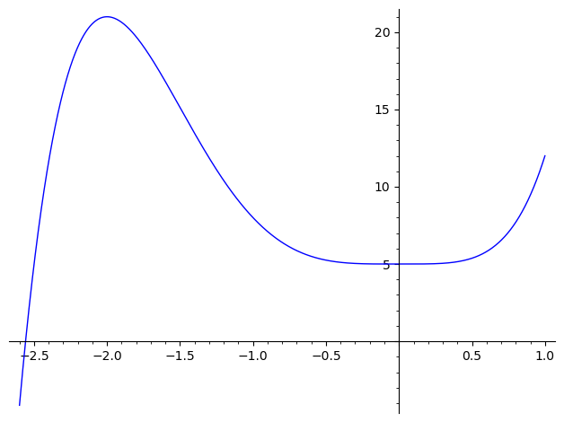

# A. Finding Radical Extensions

## Q1

### a

\begin{alignat*}{2}
L_1 &= \mathbb{Q}(\alpha_0), & \quad \alpha_0^2 &= 5 \in \mathbb{Q} \\
L_2 &= L_1(\alpha_1),        & \quad \alpha_1^5 &= 2 \in L_1 \\
L_3 &= L_2(\alpha_2),        & \quad \alpha_2^4 &= 3 \in L_2 \\
L_4 &= L_3(\alpha_3),        & \quad \alpha_3^3 &= 4 \in L_3 \\
\end{alignat*}

### b

\begin{alignat*}{2}
L_1 &= \mathbb{Q}(\alpha_0), & \quad \alpha_0^9 &= 2 \in \mathbb{Q} \\
L_2 &= L_1(\alpha_1),        & \quad \alpha_1^2 &= 5 \in L_1 \\
L_3 &= L_2(\alpha_2),        & \quad \alpha_2^3 &= 1 - \sqrt{5} \in L_2 \\
L_4 &= L_3(\alpha_3),        & \quad \alpha_3^2 &= \frac{1 - \alpha_0}{\alpha_2} \in L_3 \\
\end{alignat*}

### c

\begin{alignat*}{2}
L_1 &= \mathbb{Q}(i), & \quad i^2 &= 1 \in \mathbb{Q} \\
L_2 &= L_1(\alpha_1),        & \quad \alpha_1^2 &= 3 \in L_1 \\
L_3 &= L_2(\alpha_2),        & \quad \alpha_2^2 &= 11 \in L_2 \\
L_4 &= L_3(\alpha_3),        & \quad \alpha_3^5 &= \frac{(\alpha_1 - 2i)^3}{i - \alpha_2} \in L_3 \\
\end{alignat*}

## Q2

### a

The polynomial $2x^5 - 5x^4 + 5$ is irreducible by Eisenstein's criteria using divisor $5$ given that $5 \mid a_i : i \neq 5$, $5 \nmid a_5$, and $5^2 \nmid a_0$.

```python
sage: plot(2 * x ^ 5 + 5 * x ^ 4 + 5, (-2.6, 1))
```



Point of inflection at $(0, 5)$.

```python
sage: diff(2 * x ^ 5 + 5 * x ^ 4 + 5)
10*x^4 + 20*x^3
sage: solve(_, x)
[x == -2, x == 0]
sage: a = 2 * x ^ 5 + 5 * x ^ 4 + 5
sage: a(x=-2), a(x=0)
(21, 5)
```

Minimum is $(0, 5)$ and maximum is $(-2, 21)$.

$a(x)$ thus only crosses the x-axis once and has one real root $r_1$, and four complex roots $r_2, r_3, r_4, r_5$ with $r_2, r_3$ and $r_4, r_5$ being complex conjugates of each other.

The permutation group of $r_1, r_2, r_3, r_4, r_5$ which is $\mathbf{G}$ is a subgroup of $S_5$.

Since $a(x)$ is irreducible in $\mathbb{Q}$, so $[\mathbb{Q}(r_1): \mathbb{Q}] = 5$. So $5$ is a factor of $[K: \mathbb{Q}]$. Thus $\mathbf{G}$ contains an element of order 5.

The automorphism $(r_1 r_2 r_3 r_4)$ has order 4, $(r_1 r_2 r_3)$ has order 3, $(r_1 r_2 r_3)(r_4 r_5)$ order 6, which only leaves the cycle of length 5 $(r_1 r_2 r_3 r_4 r_5)$ which has order 5. Thus $\mathbf{G}$ contains an automorphism which is a cycle permutation of the roots $r_1, r_2, r_3, r_4, r_5$ of length 5.

From 8H5, we saw that a transposition $(12)$ and a cycle $(12345)$ will generate $S_5$. The proof follows: $(12345)(12)(12345)^{-1} = (23), (12)(23)(12) = (13)$. Repeating the process we get $(12345)(13)(12345)^{-1} = (24), (12)(24)(12) = (14), (12345)(14)(12345)^{-1} = (25), (12)(25)(12) = (15)$. Finally the set $T_1 = \{ (12), (13), \dots, (15) \}$ generates $S_5$.

Thus $\mathbf{G} = S_5$ and since $S_5$ is not solvable, there is no radical solution for $a(x)$.

## b

```python
sage: a = x ^ 5 - 4 * x ^ 2 + 2
sage: diff(a)
5*x^4 - 8*x
sage: solve(_, x)
[x == 1/5*5^(2/3)*(I*sqrt(3) - 1), x == 1/5*5^(2/3)*(-I*sqrt(3) - 1), x == 2/5*5^(2/3), x == 0]
```

```python
sage: plot(a, (-1, 2))
```


The graph has a maximum at $x = 0$, and a minimum at $x = \frac{2}{5} \sqrt[3]{5}^2$. $a(x)$ crosses
the x-axis 3 times and so has two imaginary roots.

By the [complex conjugate root theorem](https://en.wikipedia.org/wiki/Complex_conjugate_root_theorem),
the complex roots of $a(x)$ are conjugate pairs. Therefore $a(x)$ has three real roots, and two imaginary
roots. By the reasoning in the question above, there is a cycle of length 5 and a transposition between
the imaginary roots.

Thus the group for $a(x)$ is $S_5$ which is unsolvable implying there is no radical solution.

## c

```python
sage: a = x ^ 5 - 4 * x ^ 4 + 2 * x + 2
sage: ad = diff(a)
sage: sols = solve(ad, x)
sage: for s in sols:
....:     print(s.rhs().n())
-0.259418669419159 - 0.411017935127584*I
-0.259418669419159 + 0.411017935127584*I
0.531186796300305
3.18765054253801
sage: plot(a, (-1, 4))
Launched png viewer for Graphics object consisting of 1 graphics primitive
sage: (sols[0].rhs() * sols[1].rhs()).n()
0.236233789039750 - 4.16333634234434e-17*I
sage: (sols[0].rhs() * sols[1].rhs()).n().imag_part() < 0.000000000001
True
sage: # rounding error, so ignore that part
sage: # 3 roots:
sage: 0.236233789039750, 0.531186796300305, 3.18765054253801  # for max and mins
(0.236233789039750, 0.531186796300305, 3.18765054253801)
```


We can see from the differentiated curve, that $a(x)$ is decreasing below $x = -1$ and increasing above $x = 4$.
Thus it crosses the x-axis three times, and so has three real roots, and two imaginary roots.

By the argument before this implies the group for this curve is $S_5$ which is unsolvable.

## Q3

$$a(x) = (x - 2)^5 - (x - 2)$$
Let $a(x) = 0$ then
$$(x - 2)^4 = 1$$
The fourth roots of $1$ are $\pm i, \pm 1$. The remaining root of $a(x)$ is $x = 2$.
All these roots are real and solvable.

## Q4

Substituting $y = x^2$, we get $a(x) = ay^4 + by^3 + cy^2 + dy + e$ which is easily solvable.
Any solution is then solvable for $x$ since $x = \pm \sqrt{y}$ which is itself a solvable equation.

## Q5

There is no general solution for polynomials of degree 5, but there are polynomials of degree 5 which
have a solvable group.

# B. Solvable Groups

## Q1

Every subgroup of an abelian group is a normal subgroup.

Let $G$ be an abelian group with $x \in G$, and $H$ a subgroup with $a \in H$. Since $xax^{-1} = axx^{-1} = a \in H$, $H$ is a normal subgroup of $G$.

The set of commutators for an abelian group is $\{ e \} \implies Hxyx^{-1}y^{-1} = Hxy(yx)^{-1} = H \implies Hxy = Hyx \implies G/H$ is abelian.

From these two derivable properties of an abelian group, we see that every abelian group is also a solvable group.

## Q2

The intersection of two subgroups of $G$ is a subgroup of $G$. For example $e \in J_0 = K \cap H_0$. For any $a \in J_0$, both $K$ and $H_0$ contain $a^{-1} \implies a^{-1} \in J_0$, likewise for products $a, b \in J_0 \implies ab \in J_0$.

All the iterated groups $J_i$ are subgroups of $K$, with $J_i \triangleleft J_{i + 1}$. Observe that $J_{i + 1}$ is a subgroup of $H_{i + 1}$. Let $x \in J_{i + 1}, a \in J_i$ then $xax^{-1} \in K \cap H_i = J_i$. Thus $J_i$ is a normal subgroup of $J_{i + 1}$.

Thus the sequence $J_0, \dots, J_n$ is a normal series of $K$.

## Q3

$H_{i + 1} / H_i$ is abelian $\implies$ $H_i$ contains all the commutators $xyx^{-1}y^{-1} \in H_{i + 1}$. Let $x, y \in J_{i + 1}$, then $xyx^{-1}y^{-1} \in J_{i + 1}$ and also $K$. Observe $xyx^{-1}y^{-1} \in H_i \cap K = J_i \implies J_{i + 1} / J_i$ is abelian. Thus the series $\{ e \} = J_0 \triangleleft J_1 \triangleleft \cdots \triangleleft J_n = K$ is a solvable series of $K$.

## Q4

Combining the above two parts, we see that given a solvable group, any subgroup $K \subseteq G$ is also a solvable group.

## Q5

$S_3$, the [dihedral group of order 6](https://en.wikipedia.org/wiki/Dihedral_group_of_order_6) has six elements generated by $\langle a, b \rangle = \{ e, \alpha = a, 
\beta = b, \delta = aba, \kappa = ab, \gamma = ba \}$. The subgroup $\{ e, \beta = b, \delta = aba \}$
$$\alpha^{-1} = \alpha \quad \beta^{-1} = \delta \quad \gamma^{-1} = \gamma$$
$$\delta^{-1} = \beta \quad \kappa^{-1} = \kappa$$
\begin{alignat*}{2}
\alpha \beta \alpha^{-1}    &= \alpha \beta \alpha      &= \alpha \kappa    &= \delta \\
\kappa \beta \kappa^{-1}    &= \kappa \beta \kappa      &= \kappa \gamma    &= \delta \\
\gamma \beta \gamma^{-1}    &= \gamma \beta \gamma      &= \gamma \alpha    &= \delta \\
\alpha \delta \alpha^{-1}   &= \alpha \delta \alpha     &= \alpha \gamma    &= \beta \\
\kappa \delta \kappa^{-1}   &= \kappa \delta \kappa     &= \kappa \alpha    &= \beta \\
\gamma \delta \gamma^{-1}   &= \gamma \delta \gamma     &= \gamma \kappa    &= \beta \\
\end{alignat*}
So $\{ \epsilon, \beta, \delta \}$ absorbs products from $S_3$ and is a normal subgroup. Since $S_3$ has a solvable series, we conclude $S_3$ is a solvable group, and by part 4, that every subgroup is also solvable.

## Q6

$$B = \{ e, (12)(34), (13)(24), (14)(23) \}$$
$$A_4 = \{ e, (12)(34), (13)(24), (14)(23), (13)(12), (12)(13), (14)(13), (13)(14), (14)(12), (12)(14), (24)(23), (23)(24) \}$$
$$[S_4: A_4] = 2$$
Every index 2 subgroup is abelian.

$B$ is the Klein subgroup of $A_4$ which is isomorphic to $\mathbb{Z}_2 \times \mathbb{Z}_2$. It is an abelian normal subgroup. Therefore also $A_4/B$ is abelian.

# C. $p$th Roots of Elements in a Field

## Q1

All roots of $x^p - a$ are of the form $d = \omega^k \sqrt[p]{a} : k \leq n - 1$. Since $\omega^{-k} \in F(\omega), \sqrt[p]{a} \in F(\omega, d)$.
See 31E5 and 31E6.

## Q2

The question has a typo [as explained here](https://math.stackexchange.com/questions/4214628/factors-of-xp-a) and should say "degree $\geq 2$".

$x^p - a$ is reducible in $F[x]$ by the question, so $x^p - a = p(x)f(x) = (x - z_1)(x - z_2) \cdots (x - z_p)$.

Since $x^p - a$ reduces to factors $p(x)$ and $f(x)$, and $z_i \notin F$, we conclude that $\deg p(x) \geq 2$.
Therefore $p(x) = (x - z_1)(x - z_2) \cdots (x - z_m)$ for some $m$ and $b = z_1 z_2 \cdots z_m \in F$. Likewise for $f(x)$.

## Q3

From above $p(x)$ splits into linear terms of $p(x) = (x - z_1)\cdots(x - z_m)$ with a constant term $b = z_1 \cdots z_m$.

Since the roots of $x^p - a$ are of the form $\omega^j \sqrt[p]{a}$ so $b = (\omega^j \sqrt[p]{a})^m = \omega^{jm} \sqrt[p]{a}^m$.
But $d = \omega^{i} \sqrt[p]{a}$ or $\sqrt[p]{a} = \omega^{-i} d \implies b = \omega^{jm} (\omega^{-i} d)^m = \omega^k d^m$ for some $k$.

## Q4

$$b^p = (\omega^k d^m)^p = (\omega^p)^k (d^p)^m = a^m$$

## Q5

$$\deg p(x) = m \geq 2, \deg f(x) = p - m \geq 2 \implies m \neq p$$
$p$ is prime $\implies m \nmid p \implies \exists s, t: sm + tp = 1$.

## Q6

$$b^p = a^m \implies b^{sp} = (b^p)^s = (a^m)^s = a^{sm}$$
But $sm + tp = 1$
$$a^{sm} = a^{1 - tp} = a \cdot a^{-tp}$$
$$\implies b^{sp} a^{tp} = a$$
$$\implies (b^s a^t)^p = a$$

## Q7

$c = b^s a^t$ is a solution for the equation $x^p - a$, so when $x^p - a$ is reducible it has a root in the field $F$.
Since $p(x) \in F[x]$ which means its constant term $b \in F$.

Otherwise we conclude that $F$ is irreducible over $F$.

# D. Another Way of Defining Solvable Groups

## Q1

By the definition, a subgroup is always contained in a maximal subgroup (if it's not maximal itself).

Because every finite group is a finite set, every chain of proper subgroups of a finite group has a maximal element and thus every finite group has a maximal subgroup. The same applies to maximal normal subgroups.

## Q2

$J \triangleleft H$ and $\ran f = H$, so there exists a set $X$ of input values such that $f(X) = J$. Then $X = f^{-1}(J)$. For $a, b \in X, f(ab) = f(a)f(b) \in J$ which preserves group structure. Also $e_G \in J \implies e_H \in X$. And for the normal property let $g \in G$ then $f(g) f(a) (f(g))^{-1} = f(gag^{-1}) \in J \implies gag^{-1} \in X$.

## Q3

Let $f: G \rightarrow G/K$ by $f(a) = Ka$. $\mathcal{F} \triangleleft G/K \implies f^{-1}(\mathcal{F}) \triangleleft G$. But $f^{-1}(\mathcal{F}) = \hat{\mathcal{F}}$.

## Q4

This question is equivalent to proving the quotient group $G/K$ of a maximal normal subgroup $K$ is simple.

Let $H$ be a normal subgroup in $G/K$. Then $\hat{H}$ is the union of cosets in $H$. Then $K \triangleleft \hat{H} \triangleleft G \implies \hat{H} = G$.

## Q5

Let $|G| = n = p_1 \cdots p_k$. Then for each $p_i$ there is an element $a \in G : \ord(a) = p_i \implies \langle a \rangle \subseteq G$. Thus there are $k$ subgroups in $G$ of order $p_i$.

$G$ has only the trivial subgroups $\{ e \}$ and $G \implies |G| = p$ for some prime $p$ with an element $a : \ord(a) = p$. Therefore $G = \langle p \rangle$.

## Q6

$$f: G/H \rightarrow G/K$$
$$f(Ha) = Ka$$

$$f(H) = K$$
$$f(Hab) = Kab = (Ka)(Kb) = f(a)f(b)$$

## Q7

$$|G/H| = 1 \implies H = G$$

$$|G/H| = 2 \implies H = H_0 \triangleleft H_q = G$$
and $H_{i + 1} / H_i$ is cyclic of order 2.

Now let $|G/H| = n$ and assume the statement is true for groups $|G/H| < n$.

If there is no subgroup $J$ between $H$ and $G$ such that $H \subseteq J \subseteq G$, then $H$ is a maximal normal subgroup of $G$. By part 4 above $G/H$ only contains trivial subgroups. By part 5, since the group is trivial it can only contain generators of the group which are prime order by Cauchy's theorem, and therefore $G/H$ is a cyclic group of prime order.

Lastly we deal with the case that $H$ is not a maximal normal subgroup where
$$H = H_0 \triangleleft H_1 \triangleleft \cdots \triangleleft H_{q - 1} = J \triangleleft H_q = G$$
Let $|H| = k$, then since $|G/H| = n$, $|G| = nk$.
$$H_0 \subseteq H_{q - 1} \implies |H_{q - 1}| > k \implies |H_q / H_{q - 1}| < n$$
Therefore by our inductive assumption, $H_q / H_{q + 1}$ is cyclic of prime order.

Likewise $H_1 \subseteq G \implies |H_1| < nk \implies |H_1/H_0| < n$. This can be generalized to
$$|H_i / H_0| < n \textrm{ for } i > 0$$
And $H_0 \subseteq H_i \implies |H_i| > k$
$$\implies |G/H_i| < n$$
$$\implies |H_{i + 1} / H_i| < n \textrm{ (by combining both statements) }$$

Which by our inductive assumption means that $H_{i + 1} / H_i$ is a cyclic group of prime order.

# E. If $\Gal(K: F)$ Is Solvable, $K$ is a Radical Extension of $F$

## Q1

$$K = F_0$$
$$H_q = \mathbf{G}$$
$$H_0 = \Gal(K : K) = \{ e \}$$
$$H_i = \Gal(K : F_i)$$
$$H_{i + 1} = \Gal(K : F_{i + 1})$$
$$H_i \subseteq H_{i + 1} \iff F_{i + 1} \subseteq F_i$$

The lemma after theorem 2 in chapter 32 states that the number of elements in $H_i$ is equal to $[K : F_i]$.

$$|H_i| = [K : F_i]$$
\begin{align*}
|H_{i + 1}| &= [K : F_{i + 1}] \\
    &= [K : F_i][F_i : F_{i + 1}]
\end{align*}
$$\frac{|H_{i + 1}|}{|H_i|} = |H_{i + 1} / H_i| = p$$

To show $F_i$ forms an iterated normal extension, first we let $F_i = F_{i + 1}(c)$.
Assume $F_{i + 1}$ is a normal extension of $F_0$. $c^n = a \in F_{i + 1}$.

$$H_{i + 1} = \{ h_1, \dots, h_r \}$$
$$b(x) = [x^n - h_1(a)] \cdots [x^n - h_r(a)]$$
$$\bar{h_i} : K[x] \rightarrow K[x]$$
$$\bar{h_i(b(x))} = b(x) \implies b(x) \in F_{i + 1}[x]$$

$F_i$ is the splitting field of $b(x)$ over $F_{i + 1} \implies F_i$ is a normal extension of $F_{i + 1}$.

## Q2

$$\omega \in F_{i + 1} \implies \pi(\omega) = \omega$$
$$\pi(c) = \pi(b) + \omega b + \omega^2 \pi^{-1}(b) + \cdots + \omega^{p - 1} \pi^{-(p - 2)}(b)$$
$$[F_i : F_{i + 1}] = p \implies \langle \pi \rangle = p$$
$$\omega c = \omega b + \omega^2 \pi^{-1}(b) + \cdots + \omega^{p - 1} \pi^{-(p - 2)}(b) + \omega^p \pi^{-(p - 1)}(b)$$
$$\omega^p = 1, \pi^{-p} = \pi^0$$
$$\implies \omega c = \omega b + \omega^2 \pi^{-1}(b) + \cdots + \omega^{p - 1} \pi^{-(p - 1)}(b) + \pi(b)$$
$$\pi(c) = \omega c$$

## Q3

$$\pi(c) \pi(c) = \omega^2 c^2$$
$$\implies \pi^k(c) = \omega^k c^k$$
\begin{align*}
\pi^p(c) &= \omega^p c^p \\
    &= c^p
\end{align*}
But $\Gal(F_i: F_{i + 1}) = \langle \pi \rangle$ so $\pi^p = e$ so $\pi^p(c) = c$
$$c^p = c$$
$$\pi^k(c) = \pi^k(c^p) = c^p$$
since $\Gal(F_i: F_{i + 1}) = \langle \pi \rangle$, and $\pi^k(c^p) = c^p$, all automorphisms fix $c^p$, and so $F_{i + 1}$ is the fixfield of $\Gal(F_i: F_{i + 1})$.

## Q4

There are $p$ automorphisms $\pi^i \in \langle \pi \rangle$ which permute any root of $x^p - c^p$ to another unique root.

$x^p - c^p \in F_{i + 1}[x]$, and we know at least one root $b \in F_i$ so all roots are in $F_i$.

## Q5

$F_q = F$ and $F_0 = K$, such that $F_q \subseteq \cdots \subseteq F_0$ such that each $F_i$ contains all roots of $x^p - c^p$ where $[F_i : F_{i + 1}] = p$. Thus each extension is radical over the previous one.

We conclude that $K$ is a radical extension of $F$.
